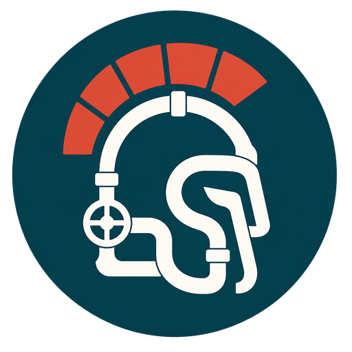

  

<h1 align="center">Hydronicus</h1>

  <strong>One plant. Many zones. No valve fights.</strong>

Hydronicus gives Home Assistant a topology-aware brain for hydronic heating and cooling.
It models the whole plant, then coordinates comfort zones, hydraulic circuits, valves, pumps, heat sources, and safety interlocks as one deterministic system.

## Why Hydronicus?

A hydronic plant is more than a pile of thermostats.
Zones can share pumps, circuits can share valves, and equipment must start and stop in a safe order.
Hydronicus understands those relationships, keeps shared equipment under one controller, and explains why every route is requested, idle, or blocked.

## Current status

Hydronicus is in early alpha and operates in shadow mode only.
It observes configured Home Assistant entities, compiles the plant topology, and calculates what the system would request without issuing service calls to physical equipment.

The current implementation supports:

- UI-based plant setup and reconfiguration.
- Comfort zones with configurable temperature sensors and targets.
- Hydraulic circuits and explicit delivery routes.
- Shared valve and pump modeling.
- Deterministic demand evaluation.
- Read-only climate, demand, and plant-status entities.

Active equipment control, safety interlocks, heating and cooling changeover, source coordination, diagnostics, and repairs are planned as the controller matures.

## Installation

Hydronicus requires Home Assistant 2026.7.0 or newer.

1. In HACS, open **Integrations**.
2. Add `https://github.com/brumi1024/ha-hydronicus` as a custom repository with the **Integration** category.
3. Install **Hydronicus** and restart Home Assistant.
4. Open **Settings > Devices & services**, select **Add integration**, and search for **Hydronicus**.

New plants start in shadow mode so the compiled topology and controller decisions can be reviewed before future active-control features are enabled.

## Safety

Hydronicus is software coordination, not a substitute for physical safety controls.
Temperature limits, condensation protection, pressure relief, flow protection, and other critical safeguards must remain independently enforced by suitable hardware.

## Development

The controller core is deliberately isolated from Home Assistant imports so its behavior can be tested as a pure deterministic model.
See [the implementation plan](docs/implementation-plan.md) for the domain model, architecture, safety rules, and roadmap.
See [the development environment](docs/development.md) for reproducible setup and verification commands.
Use [the home-server staging contract](docs/home-server-staging.md) for final Home Assistant UI and runtime checks.

Contributions are welcome while the project is taking shape.
